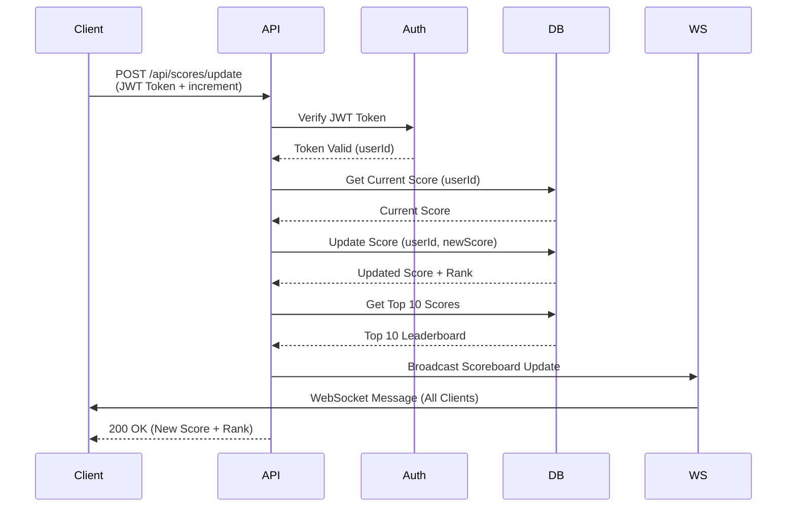
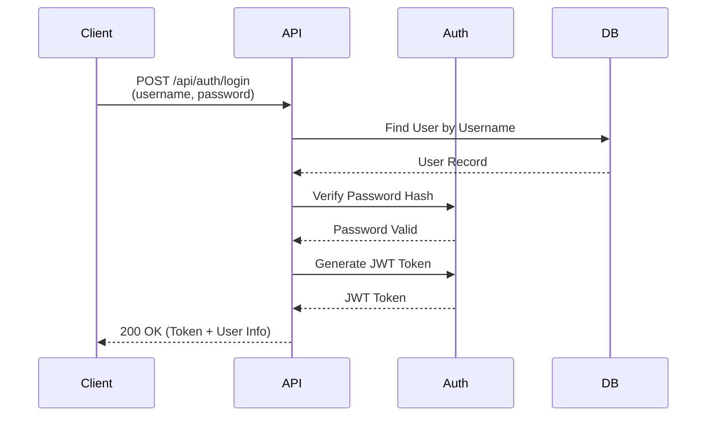
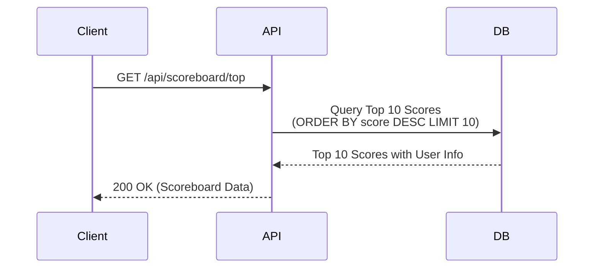
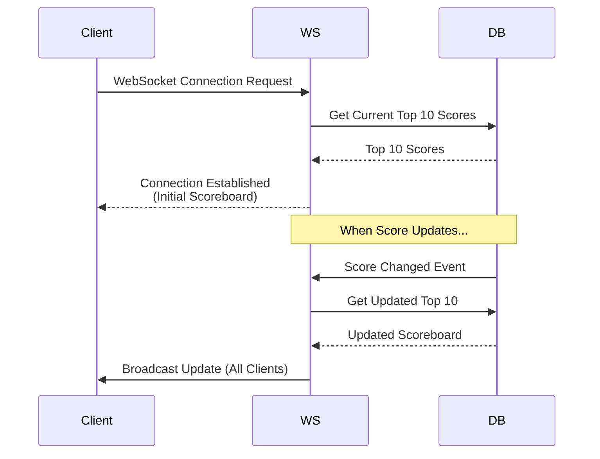

# Problem 6 - Live Scoreboard API Service

A real-time scoreboard API service built with Express.js, TypeScript, and WebSocket support. This module provides secure score management with JWT authentication and live updates for displaying top 10 user scores.

## Table of Contents

- [Overview](#overview)
- [Features](#features)
- [Tech Stack](#tech-stack)
- [Architecture](#architecture)
- [API Specification](#api-specification)
- [Database Schema](#database-schema)
- [Authentication](#authentication)
- [Live Updates](#live-updates)
- [Execution Flow](#execution-flow)
- [Installation](#installation)
- [Configuration](#configuration)
- [Usage Examples](#usage-examples)
- [Security Considerations](#security-considerations)
- [Future Improvements](#future-improvements)

## Overview

This module provides a backend API service for managing user scores in a real-time scoreboard system. The service ensures that only authenticated users can update their scores and broadcasts scoreboard changes to all connected clients in real-time.

### Key Requirements

1. ✅ Display top 10 user scores
2. ✅ Real-time live updates via WebSocket
3. ✅ Secure score updates with JWT authentication
4. ✅ Prevent unauthorized score manipulation
5. ✅ RESTful API endpoints for scoreboard operations

## Features

- **JWT Authentication** - Secure token-based authentication for score updates
- **Real-time Updates** - WebSocket support for live scoreboard updates
- **Top 10 Leaderboard** - Efficient querying of top scores
- **Score Validation** - Prevents negative scores and validates score increments
- **User Management** - User registration and authentication
- **Database Persistence** - SQLite database for data storage
- **Type Safety** - Full TypeScript support

## Tech Stack

- **Express.js** - Web framework for REST API
- **TypeScript** - Type-safe JavaScript
- **JWT (jsonwebtoken)** - Token-based authentication
- **WebSocket (ws)** - Real-time bidirectional communication
- **SQLite (better-sqlite3)** - Lightweight database
- **bcrypt** - Password hashing
- **CORS** - Cross-origin resource sharing

## Architecture

### Project Structure

```
src/problem6/
├── src/
│   ├── main.ts                    # Application entry point
│   ├── database/
│   │   └── db.ts                  # Database connection and schema
│   ├── types/
│   │   ├── user.ts                # User type definitions
│   │   └── score.ts               # Score type definitions
│   ├── models/
│   │   ├── userModel.ts           # User data access layer
│   │   └── scoreModel.ts          # Score data access layer
│   ├── controllers/
│   │   ├── authController.ts      # Authentication logic
│   │   ├── scoreController.ts     # Score update logic
│   │   └── scoreboardController.ts # Scoreboard retrieval logic
│   ├── routes/
│   │   ├── authRoutes.ts          # Authentication routes
│   │   ├── scoreRoutes.ts         # Score update routes
│   │   └── scoreboardRoutes.ts    # Scoreboard routes
│   ├── middleware/
│   │   ├── authMiddleware.ts      # JWT authentication middleware
│   │   └── validationMiddleware.ts # Request validation
│   └── websocket/
│       └── websocketServer.ts     # WebSocket server for live updates
├── package.json
├── tsconfig.json
└── README.md
```

### System Architecture

```
┌─────────────┐
│   Client    │
│  (Browser)  │
└──────┬──────┘
       │
       ├─────────────────────────────────┐
       │                                 │
       ▼                                 ▼
┌──────────────┐                ┌──────────────┐
│   REST API   │                │  WebSocket  │
│  (Express)   │                │   Server    │
└──────┬───────┘                └──────┬──────┘
       │                               │
       ├───────────────┬───────────────┤
       │               │               │
       ▼               ▼               ▼
┌─────────────┐ ┌─────────────┐ ┌─────────────┐
│   Auth      │ │  Score      │ │ Scoreboard  │
│ Controller  │ │ Controller  │ │ Controller  │
└──────┬──────┘ └──────┬──────┘ └──────┬──────┘
       │               │               │
       └───────┬───────┴───────┬───────┘
               │               │
               ▼               ▼
       ┌───────────────┐ ┌───────────────┐
       │  User Model   │ │  Score Model  │
       └───────┬───────┘ └───────┬───────┘
               │                 │
               └────────┬────────┘
                        │
                        ▼
              ┌─────────────────┐
              │  SQLite Database│
              │   (data.db)     │
              └─────────────────┘
```

## API Specification

### Base URL

```
http://localhost:3000
```

### Authentication Endpoints

#### 1. Register User

**POST** `/api/auth/register`

Creates a new user account.

Request Body:

```json
{
  "username": "player1",
  "password": "123456@",
  "email": "player1@example.com"
}
```

Response: `201 Created`

```json
{
  "message": "User registered successfully",
  "userId": "user-uuid"
}
```

Error Responses:

- `400 Bad Request` - Validation error (missing fields, invalid email, etc.)
- `409 Conflict` - Username or email already exists

#### 2. Login

**POST** `/api/auth/login`

Authenticates a user and returns a JWT token.

Request Body:

```json
{
  "username": "player1",
  "password": "123456@"
}
```

Response: `200 OK`

```json
{
  "token": "eyJhbGciOiJIUzI1NiIsInR5cCI6IkpXVCJ9...",
  "user": {
    "id": "user-uuid",
    "username": "player1",
    "email": "player1@example.com"
  }
}
```

Error Responses:

- `400 Bad Request` - Missing username or password
- `401 Unauthorized` - Invalid credentials

### Scoreboard Endpoints

#### 3. Get Top 10 Scores

**GET** `/api/scoreboard/top`

Retrieves the top 10 users by score.

Response: `200 OK`

```json
{
  "scores": [
    {
      "userId": "user-uuid-1",
      "username": "player1",
      "score": 1500,
      "rank": 1,
      "updatedAt": "2024-01-15T10:30:00Z"
    },
    {
      "userId": "user-uuid-2",
      "username": "player2",
      "score": 1200,
      "rank": 2,
      "updatedAt": "2024-01-15T10:25:00Z"
    }
    // ... up to 10 entries
  ],
  "totalPlayers": 150
}
```

#### 4. Get User's Current Score

**GET** `/api/scoreboard/user/:userId`

Retrieves a specific user's score and rank.

Response: `200 OK`

```json
{
  "userId": "user-uuid",
  "username": "player1",
  "score": 1500,
  "rank": 1,
  "updatedAt": "2024-01-15T10:30:00Z"
}
```

Error Response:

- `404 Not Found` - User not found

### Score Update Endpoints

#### 5. Update Score

**POST** `/api/scores/update`

Increments the user's score. Requires JWT authentication.

**Headers:**

```
Authorization: Bearer <JWT_TOKEN>
```

Request Body:

```json
{
  "increment": 10
}
```

Response: `200 OK`

```json
{
  "message": "Score updated successfully",
  "userId": "user-uuid",
  "previousScore": 1490,
  "newScore": 1500,
  "rank": 1
}
```

Error Responses:

- `400 Bad Request` - Invalid increment value (must be positive)
- `401 Unauthorized` - Missing or invalid JWT token
- `500 Internal Server Error` - Database error

### WebSocket Endpoint

#### 6. Live Scoreboard Updates

**WebSocket** `ws://localhost:3000/ws/scoreboard`

Connects to the WebSocket server to receive real-time scoreboard updates.

**Connection:**

```javascript
const ws = new WebSocket('ws://localhost:3000/ws/scoreboard');
```

**Messages Received:**

```json
{
  "type": "scoreboard_update",
  "data": {
    "scores": [
      {
        "userId": "user-uuid-1",
        "username": "player1",
        "score": 1500,
        "rank": 1
      }
      // ... top 10 scores
    ],
    "updatedAt": "2024-01-15T10:30:00Z"
  }
}
```

**Message Types:**

- `scoreboard_update` - Broadcasted when any score changes
- `connection_established` - Sent when client connects
- `error` - Error messages

### Health Check

**GET** `/health`

Response: `200 OK`

```json
{
  "status": "ok",
  "message": "Server is running",
  "timestamp": "2024-01-15T10:30:00Z"
}
```

## Database Schema

### Users Table

```sql
CREATE TABLE users (
  id TEXT PRIMARY KEY,
  username TEXT UNIQUE NOT NULL,
  email TEXT UNIQUE NOT NULL,
  password_hash TEXT NOT NULL,
  created_at DATETIME DEFAULT CURRENT_TIMESTAMP,
  updated_at DATETIME DEFAULT CURRENT_TIMESTAMP
);
```

### Scores Table

```sql
CREATE TABLE scores (
  id TEXT PRIMARY KEY,
  user_id TEXT NOT NULL,
  score INTEGER NOT NULL DEFAULT 0,
  updated_at DATETIME DEFAULT CURRENT_TIMESTAMP,
  FOREIGN KEY (user_id) REFERENCES users(id) ON DELETE CASCADE,
  UNIQUE(user_id)
);

CREATE INDEX idx_scores_score ON scores(score DESC);
CREATE INDEX idx_scores_user_id ON scores(user_id);
```

## Authentication

### JWT Token Structure

The JWT token contains:

```json
{
  "userId": "user-uuid",
  "username": "player1",
  "iat": 1705312800,
  "exp": 1705316400
}
```

### Token Expiration

- Default expiration: 24 hours
- Configurable via `JWT_EXPIRES_IN` environment variable

### Authentication Flow

1. User registers or logs in
2. Server validates credentials
3. Server generates JWT token with user information
4. Client stores token (localStorage, sessionStorage, or cookie)
5. Client includes token in `Authorization` header for protected endpoints
6. Server validates token on each request
7. Server extracts user information from token

## Live Updates

### WebSocket Implementation

The WebSocket server broadcasts scoreboard updates to all connected clients whenever:

- A user's score is updated
- The top 10 leaderboard changes

### Connection Management

- Clients automatically reconnect on disconnect
- Server maintains a list of active connections
- Broadcasts are sent to all connected clients simultaneously

### Message Format

All WebSocket messages follow this structure:

```json
{
  "type": "message_type",
  "data": {
    /* message-specific data */
  },
  "timestamp": "ISO-8601 timestamp"
}
```

## Execution Flow

### Score Update Flow



### Authentication Flow



### Scoreboard Retrieval Flow



### WebSocket Connection Flow



## Installation

### Prerequisites

- Node.js (v16 or higher)
- npm or yarn

### Steps

1. Navigate to the problem6 directory:

```bash
cd src/problem6
```

2. Install dependencies:

```bash
npm install
```

3. Build the TypeScript code:

```bash
npm run build
```

4. Start the server:

```bash
npm start
```

For development with auto-reload:

```bash
npm run dev
```

## Configuration

### Environment Variables

Create a `.env` file in the project root:

```env
# Server Configuration
PORT=3000

# JWT Configuration
JWT_SECRET=secret-jwt-key
JWT_EXPIRES_IN=24h

# Database Configuration
DB_PATH=./data.db

# CORS Configuration
CORS_ORIGIN=http://localhost:3000,http://localhost:5173
```

### Default Values

- **Port**: 3000
- **JWT Secret**: Must be set via environment variable (no default for security)
- **JWT Expiration**: 24 hours
- **Database**: `data.db` in project root

## Testing WebSocket Connection

### Method 1: Browser Test Page (Easiest) 🌐

**⚠️ Important:** Browsers block WebSocket connections from `file://` URLs. You must access the page through HTTP.

1. Start the server:

```bash
npm run dev
```

2. Open the test page in your browser:

   - **Go to:** `http://localhost:3000/test`
   - Or directly: `http://localhost:3000/test-websocket.html`

3. Click the "Connect" button to establish WebSocket connection

4. You'll see:

   - Connection status
   - Live scoreboard updates
   - All WebSocket messages in real-time

5. To test live updates:
   - Open another terminal
   - Update a score using the API (see examples below)
   - Watch the scoreboard update automatically in the browser!

## Usage Examples

### Register a New User

```bash
curl -X POST http://localhost:3000/api/auth/register \
  -H "Content-Type: application/json" \
  -d '{
    "username": "player1",
    "password": "123456@",
    "email": "player1@example.com"
  }'
```

### Login and Get Token

```bash
curl -X POST http://localhost:3000/api/auth/login \
  -H "Content-Type: application/json" \
  -d '{
    "username": "player1",
    "password": "123456@"
  }'
```

### Update Score (with JWT)

```bash
TOKEN="your-jwt-token-here"

curl -X POST http://localhost:3000/api/scores/update \
  -H "Content-Type: application/json" \
  -H "Authorization: Bearer $TOKEN" \
  -d '{
    "increment": 10
  }'
```

### Get Top 10 Scoreboard

```bash
curl http://localhost:3000/api/scoreboard/top
```

### WebSocket Connection (JavaScript)

```javascript
const ws = new WebSocket('ws://localhost:3000/ws/scoreboard');

ws.onopen = () => {
  console.log('Connected to scoreboard');
};

ws.onmessage = (event) => {
  const message = JSON.parse(event.data);
  if (message.type === 'scoreboard_update') {
    console.log('Scoreboard updated:', message.data);
    // Update UI with new scoreboard
  }
};

ws.onerror = (error) => {
  console.error('WebSocket error:', error);
};

ws.onclose = () => {
  console.log('Disconnected from scoreboard');
};
```

## Security Considerations

### Implemented Security Measures

1. **JWT Authentication** - All score updates require valid JWT tokens
2. **Password Hashing** - Passwords are hashed using bcrypt (salt rounds: 10)
3. **Input Validation** - All inputs are validated before processing
4. **SQL Injection Prevention** - Using parameterized queries
5. **CORS Configuration** - Restricted to allowed origins
6. **Token Expiration** - JWT tokens expire after configured time

### Security Best Practices

- ✅ Passwords are never stored in plain text
- ✅ JWT tokens include expiration
- ✅ Score increments are validated (must be positive)
- ✅ User can only update their own score (via JWT userId)
- ✅ Database uses foreign key constraints

### Additional Security Recommendations

1. **Rate Limiting** - Implement rate limiting to prevent abuse:

   - Limit score updates per user per time period
   - Limit login attempts per IP
   - Limit registration attempts

2. **HTTPS/WSS** - Use secure connections in production:

   - HTTPS for REST API
   - WSS for WebSocket connections

3. **Token Refresh** - Implement refresh token mechanism for better security

4. **Input Sanitization** - Additional input sanitization for XSS prevention

5. **Audit Logging** - Log all score updates for audit purposes

6. **IP Whitelisting** - Optional IP whitelisting for admin endpoints

## Future Improvements

### High Priority 🔴

1. **Rate Limiting**

   - Implement rate limiting middleware (e.g., express-rate-limit)
   - Limit score updates to prevent abuse
   - Example: Max 100 score updates per user per hour

2. **Score Update Validation**

   - Add maximum increment limit per request
   - Implement cooldown period between updates
   - Validate score increments are reasonable

3. **Error Handling Enhancement**

   - More detailed error messages
   - Error logging to file/system
   - Error tracking (e.g., Sentry integration)

4. **Database Optimization**
   - Add database connection pooling
   - Implement caching layer (Redis) for top 10 scores
   - Add database indexes for better query performance

### Medium Priority 🟡

5. **User Profile Management**

   - Allow users to update their profile
   - Add user avatar/profile picture support
   - User statistics (total games played, best score, etc.)

6. **Advanced Scoreboard Features**

   - Pagination for scoreboard (beyond top 10)
   - Filter by time period (daily, weekly, monthly leaderboards)
   - Historical scoreboard snapshots

7. **WebSocket Enhancements**

   - Room-based connections (separate scoreboards per game)
   - Private messaging between users
   - Connection authentication for WebSocket

8. **Testing**
   - Unit tests for controllers and models
   - Integration tests for API endpoints
   - WebSocket connection tests
   - Load testing for concurrent updates

### Low Priority 🟢

9. **Admin Dashboard**

   - Admin authentication and authorization
   - Admin panel for user management
   - Score moderation capabilities
   - System statistics and monitoring

10. **Analytics**

    - Track score update frequency
    - User engagement metrics
    - Score distribution analysis

11. **Notification System**

    - Email notifications for rank changes
    - Push notifications for mobile apps
    - Achievement system (badges, milestones)

12. **API Versioning**

    - Version API endpoints (e.g., `/api/v1/scoreboard`)
    - Support multiple API versions simultaneously

13. **Documentation**

    - OpenAPI/Swagger documentation
    - Postman collection
    - API usage examples in multiple languages

14. **Deployment**

    - Docker containerization
    - Kubernetes deployment configuration
    - CI/CD pipeline setup
    - Environment-specific configurations

15. **Monitoring & Observability**
    - Health check endpoints with detailed metrics
    - Application performance monitoring (APM)
    - Log aggregation (e.g., ELK stack)
    - Real-time dashboards

### Technical Debt

16. **Code Quality**

    - Add ESLint and Prettier configuration
    - Implement code formatting in CI/CD
    - Increase test coverage to >80%

17. **Type Safety**

    - Stricter TypeScript configuration
    - Runtime type validation (e.g., Zod)
    - Better error type definitions

18. **Database Migration**
    - Migration system for schema changes
    - Database versioning
    - Rollback capabilities

## Notes

- The database file (`data.db`) should be added to `.gitignore`
- JWT secret must be set via environment variable in production
- WebSocket connections are not authenticated by default (consider adding authentication)
- The service is designed for single-instance deployment; for horizontal scaling, consider Redis pub/sub for WebSocket broadcasting
- All timestamps are stored in UTC format
